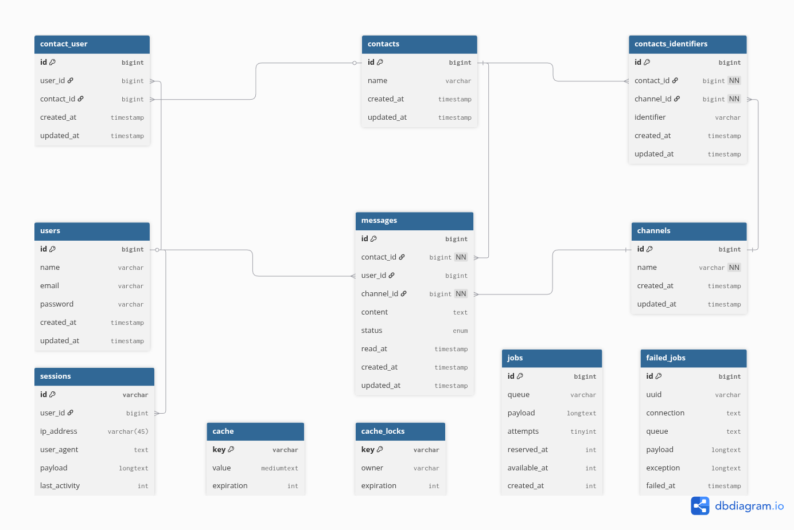

# Coding challenge: Área de Atendimento

Este projeto implementa uma área de atendimento simulada, permitindo gerenciar conversas com contatos através de diferentes canais.

**Stack:** Laravel 12, Vue 3 (Composition API), Inertia.js e Tailwind CSS.

-----

## 📋 Pré-requisitos

Antes de iniciar, garanta que você tenha o seguinte software instalado em sua máquina:

* **PHP >= 8.2** 
* **Composer** (Gerenciador de pacotes PHP)
* **Node.js >= 22.x** (Recomendado usar a versão LTS ativa, **24.x**)
* **Mysql >= 5.7**

---


## Guia de Instalação e Execução

### 1\. Clonar o Repositório

```bash
  git clone https://github.com/VictorRodriguesAlves/fs-coding-challenge.git
cd fs-coding-challenge
```

### 2\. Configuração do Backend (Laravel)

```bash
  # Instalar dependências do Composer
composer install

# Copiar o arquivo de ambiente
cp .env.example .env

# Gerar a APP_KEY
php artisan key:generate
```

### 3\. Configurar o `.env`

Abra o arquivo `.env` e configure a conexão do banco de dados.

**Exemplo para MySQL:**

```env
DB_CONNECTION=mysql
DB_HOST=127.0.0.1
DB_PORT=3306
DB_DATABASE=seu_banco_de_dados
DB_USERNAME=seu_usuario
DB_PASSWORD=sua_senha
```

**Importante:** Para que o envio de mensagens assíncrono funcione corretamente, defina a conexão da fila para `database`:

```env
QUEUE_CONNECTION=database
```

### 4\. Executando a Aplicação

Para rodar a aplicação, você precisará de **dois terminais** abertos.

**Terminal 1 (Frontend):**

```bash
  # Instalar dependências
npm install

# Iniciar o servidor de desenvolvimento
npm run dev
```

**Terminal 2 (Backend):**
```bash
  # Iniciar o servidor do Laravel
php artisan serve
```
Após ambos os comandos estarem rodando, sua aplicação estará disponível em `http://127.0.0.1:8000`.

---

## Inicialização do Banco de Dados

Para criar a estrutura de tabelas, execute o comando `migrate`. A flag `--seed` irá rodar os Seeders, que são essenciais para o sistema funcionar pois eles vão:
 
* Criar os canais padrões (whatsapp, messenger, email).
* Criar o usuário "Usuario Padrão" (ID 1).
* Criar o "Cliente Teste" e o associa ao Atendente 1.
* Criar uma primeira mensagem "não lida" para o Cliente Teste.
 
<!-- end list -->
 
```bash
   php artisan migrate --seed
``` 
 -----

## Comandos Artisan

O projeto inclui comandos customizados para gerar dados falsos e facilitar os testes.

### Gerar Novos Contatos

Este comando cria novos contatos e os associa automaticamente ao Atendente 1.

```bash
  # Gerar 5 novos contatos (padrão)
php artisan contacts:generate

# Gerar 50 novos contatos
php artisan contacts:generate --count=50
```

### Gerar Mensagens Falsas

Este comando preenche o histórico de conversas para simular um chat ativo.

```bash
  # Gerar 100 mensagens (padrão) aleatoriamente
# entre TODOS os contatos do Atendente 1
php artisan messages:generate

# Gerar 500 mensagens aleatórias
php artisan messages:generate --count=500

# Gerar 50 mensagens APENAS para o contato com ID 2
php artisan messages:generate 2 --count=50
```

-----

## Executando os Testes

O projeto utiliza Pest PHP para testes.

Para rodar todos os testes, use:

```bash
  php artisan test
```

---


## Estrutura do Banco de Dados

A modelagem foi pensada para um CRM, seguindo um modelo de **"Caixa de Entrada Compartilhada" (Shared Inbox)**.

Isso é implementado através de uma relação **N:N** entre `users` (Atendentes) e `contacts` (Clientes). A tabela pivot `contact_user`
conecta os dois, permitindo que múltiplos atendentes tenham acesso e gerenciem a mesma conversa.

### Lógica das Tabelas Principais

* **`messages`**: Esta é a tabela central. Para suportar o "Shared Inbox", a direção da mensagem é definida pelo `user_id`:

    * `user_id` **NÃO NULO**: Mensagem enviada por um atendente.
    * `user_id` **NULO**: Mensagem enviada pelo cliente (e visível por todos os atendentes que seguem o contato).

* **`channels` e `contacts_identifiers`**: Para suportar múltiplos canais, a tabela `channels` define os tipos 
(ex: 'WhatsApp', 'Email'), enquanto a `contacts_identifiers` armazena o identificador único de cada cliente para cada canal
(ex: o número `+55...` para o WhatsApp).

**Essa modelagem não apenas resolve o "Shared Inbox", mas também torna o sistema extensível. A arquitetura baseada em
tabelas de configuração (`channels`) e pivots (`contact_user`) facilita a criação de futuras telas administrativas. Um painel
de administrador, por exemplo, poderia gerenciar quais atendentes (`users`) têm acesso a quais `contacts` apenas adicionando ou
removendo registros da tabela `contact_user`. Da mesma forma, controlar os canais ativos no sistema ou gerenciar os identificadores
de cada cliente torna-se uma simples questão de um CRUD nessas tabelas dedicadas.**

O esquema também inclui as tabelas padrão do Laravel (como `jobs`, `failed_jobs`, `sessions`, etc.) necessárias para o funcionamento do sistema de filas e cache.




---


## Decisões Técnicas e Trade-offs


### 1. Arquitetura em Camadas
arquitetura isola as responsabilidades: Controllers chamam Services (onde fica a lógica de negócio),
que por sua vez usam Repositories (camada de consultas ao banco).

* **Vantagem:** Código limpo, desacoplado, fácil de testar e de manter.
* **Trade-off:** Aumento do número de arquivos e maior complexidade inicial em comparação com colocar a lógica diretamente no Controller.

### 2. Padrão Strategy (com Factory)
Para o envio de mensagens multi-canal, utilizamos o *Strategy Pattern*. A `ChannelFactory` decide qual classe (`WhatsAppChannel`, `EmailChannel`, etc.) deve 
lidar com o envio.

* **Vantagem:** Sistema **altamente extensível**. Adicionar um novo canal (ex: "telegram") requer apenas uma nova classe e uma linha na Factory, sem alterar a lógica
de negócio existente.
* **Trade-off:** Mais complexo de configurar inicialmente do que um simples `switch` ou `if/else` dentro do Job.

### 3. Modelo de Acesso N:N (Shared Inbox)
Optamos por uma tabela pivot `contact_user` em vez de um simples `contact.user_id`.

* **Vantagem:** Arquitetura flexível que permite vários atendentes gerenciando o mesmo contato, como um CRM real.
* **Trade-off:** As consultas de banco de dados para verificar permissões e carregar dados são ligeiramente mais complexas (exigem `joins` com a tabela pivot).

### 4. Processamento Assíncrono 
O envio de mensagens (`SendMessageJob`) é executado em uma **fila de forma assíncrona**.

* **Vantagem:** **Excelente experiência do usuário **. O frontend recebe uma resposta instantânea (`status: 'sending'`) em vez de travar por 1-3 segundos aguardando
a simulação da API.
* **Trade-off:** Requer a configuração de um *queue worker* no ambiente de produção, adicionando uma camada extra à infraestrutura.

---

## Possíveis Melhorias Futuras

### 1. WebSockets
* **Problema:** O *polling* é ineficiente e gera carga desnecessária no servidor.
* **Solução:** Substituir o polling por uma solução em tempo real para `broadcast` de novas mensagens. Isso eliminaria o 
delay, reduziria a carga no servidor e permitiria a implementação de indicadores de "digitando...".

### 2. Autenticação e Multi-Tenancy
* Implementar a autenticação completa para que os atendentes tenham logins individuais.
* Adicionar regras de *multi-tenancy* para que cada atendente só veja os contatos da sua própria equipe/empresa.

### 3. Painel de Administração
* Criar a interface de "Administrador" (que o banco de dados já suporta) para gerenciar quais atendentes (`users`) têm acesso a quais `contacts` 
(manipulando a tabela `contact_user`) e quais canais estão disponiveis.

### 4. Filas de Retentativa 
* Configurar políticas de retentativa (`retries`) e uma *dead-letter queue* no `SendMessageJob` para lidar com falhas reais de API 
(ex: se a API do WhatsApp estiver fora do ar) e não apenas com falhas simuladas.

### 5. Envio de Mídia (Arquivos e Fotos)
* **Problema:** A implementação atual suporta apenas mensagens de texto.
* **Solução:** Modificar o `ChatInput` para permitir o *upload* de arquivos (imagens, PDFs, etc.). Isso exigiria uma nova rota no backend para
lidar com `multipart/form-data`, uma estratégia de armazenamento (como S3 ou disco local) e uma forma de exibir mídias (em vez de texto) no `MessageItem.vue`.

### 6. Busca Full-Text (com Laravel Scout)
* **Problema:** A busca atual utilizando `LIKE` só verifica o nome do contato e o conteúdo da última mensagem. Ela é lenta e limitada.
* **Solução:** Implementar o **Laravel Scout** com um driver como **Meilisearch**. Isso permitiria indexar
a tabela `messages` e oferecer uma busca instantânea (full-text) que encontra qualquer termo em todo
o histórico de conversas, e não apenas na última.
